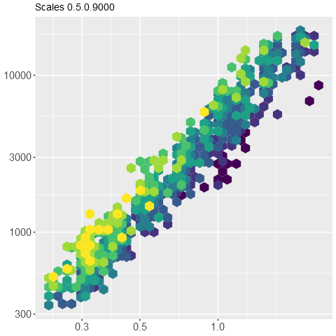
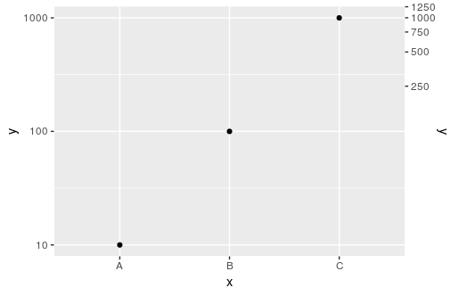
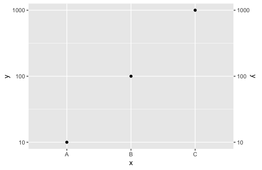
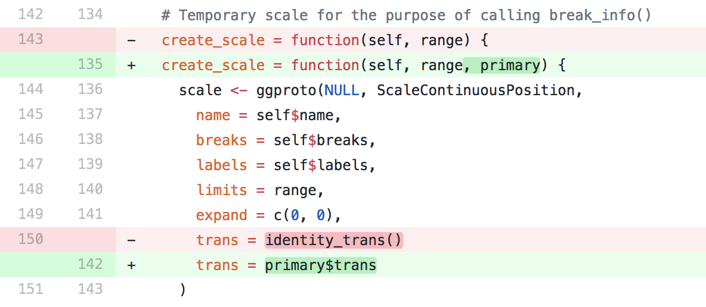
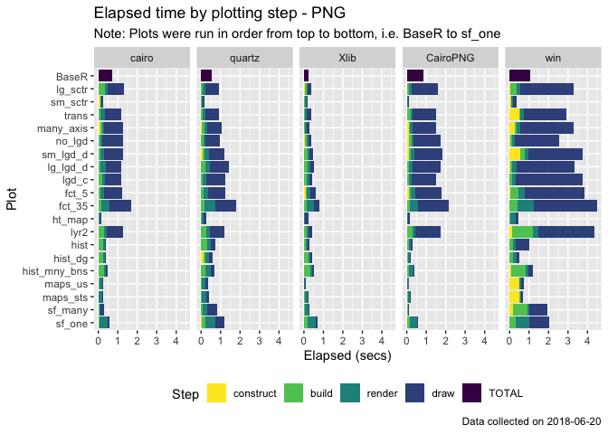

```{r setup, include=FALSE}
knitr::opts_chunk$set(
  collapse = TRUE, comment = "#>", 
  fig.align = 'center',
  fig.asp = 0.618, # 1 / phi
  out.width = "700px"
)
```

## scales 1.0.0 and select improvements <br> to ggplot2


Dana Paige Seidel 
<br>
Tidyverse Meeting, August 6, 2018

## Broad strokes: A glimpse at what I did this summer

- scales release 1.0.0
- A lot of documentation!
- ggplot2 debugging and new feature exploration
  - setting geom aesthetics via themes
  - fixing some bugs in the sec.axis api
  - some remaining puzzles

## Bean counting
* scales 1.0.0:
  - opened 19 PRs
  - merged 39 PRs
  - 24 contributors to the 1.0.0 release

* ggplot2, post 3.0.0 release
  - opened 12 PRs (1 closed, 4 merged, 7 open, 4-5 to come...)

Merged PRs in 3 tidyverse packages: scales, ggplot2, and lubridate!

## First Steps : scales 1.0.0
- issue triaged
- revived old PRs 
- moved into r-lib 
- updated readme
- built [new pkgdown site](http://scales.r-lib.org)

## Improved log_breaks()
In scales 1.0.0, `log_breaks()` returns integer multiples of integer powers of base when finer
breaks are needed (@ThierryO, #117).

Upon release this will change the default breaks of every `scale_*_log10()` call in ggplot2

## 





## Formatters
+ `number_format()` provides a generic formatter for numbers (@larmarange, #142).
+ `pvalue_format()` formats p-values
+ `byte_format()` and `bytes()` format numeric vectors into byte measurements.
+ `time_format()` formats `POSIXt` and `hms` objects
+ Spanish and French rules for `ordinal_format`

## Formatters cont.

+ The generic formatter offers consistency in behaviour and arguments across formatters
and adds additional functionality for international customization.
+ Existing formatters gained new, consistent arguments for `scale`, `accuracy`, `trim`, 
`big.mark`, `decimal.mark`, `prefix`, `suffix` etc. 
+ This release fixes a  number of bugs in the old formatters around rounding and missing 
or infinite values

## Formatter example
```{r}
library(scales)

p <- c(.2, .8, .11234, 3.14159)
percent(p)

# French percent
percent(p, big.mark = ".", decimal.mark = ",", accuracy = .01,
        suffix = " %")
```

## Transformations
* After much debate, `boxcox_trans()` has been refactored to be invertible and 
  include an offset.
* `modulus_trans()` implements the modulus transformation for positive
  and negative values. 
* New `pseudo_log_trans()` for transforming numerics into a signed logarithmic scale
  with a smooth transition to a linear scale around 0. 

## ggplot2 features, fixes, and docs

Since ggplot2 3.0.0 was release about halfway through my internship, 
I started with a lot of docs. 

Several PRs just doing careful review of documentation of the most visited reference
sites and general cleaning (spell-check, consistency)

## Initiated CII badging process
**Linux Foundation, Core Infrastructure Initiative Best Practices Badging**

- Passing badge achievable with security assurance.
- Silver badge achievable with some documentation and security review.
- Gold badge achievable with significant documentation and security changes.

My notes about the [procedure](https://docs.google.com/document/d/1D-HFVRG-z4T5fiLV8Nro5_rnq11REt2X8DYOv1vlxk4/edit?usp=sharing) for [ggplot2](https://bestpractices.coreinfrastructure.org/en/projects/1927). More detail in [Issue 2700](https://github.com/tidyverse/ggplot2/issues/2700).

## Setting aesthetics from themes -- PR 2749
**Feature : allow certain default aesthetics to be set by the plot theme.** 

* achieve better default behaviours (e.g. plotting white points by default, instead of black, when using `theme_dark()`) 
* allow user created themes to more easily control default aesthetics. 

## Setting aesthetics from themes -- PR 2749
Custom themes can now set a default `colour`, colour accents (useful for things like
`geom_smooth()`), `fill`, a fill accent, and/or `alpha`. 

Other aesthetics like `size` or `linetype` could be added as well, for now the PR
only addresses colour aesthetics. 

Aesthetic and parameter behaviour is left intact -- mapped aesthetics override
defaults, and parameters override both. 

## Examples 
```
my_theme <- theme(geom = element_geom(colour = "purple", 
                                      fill = "darkblue"))
ggplot(mpg, aes(displ, hwy)) + geom_point() + my_theme
```


## 
``` 
ggplot(mpg, aes(displ, hwy)) + geom_col() + my_theme
```


##
- `theme_dark()` now with lighter fill and colour defaults.
- Changes are fed to legend to handle discrete values properly

``` 
ggplot(mpg, aes(displ, hwy, shape = drv)) + 
  geom_point() + theme_dark()
```


## Secondary Axis work
After discussion with @thomasp85, I simplified the `AxisSecondary` code
to fix `sec.axis` behaviour for log transforms

##
```
df <- data.frame(x = c("A", "B", "C"),
                 y = c(10, 100, 1000))

ggplot(data = df, aes(x, y)) +
  geom_point() +
  scale_y_log10(sec.axis = dup_axis())
```



## Secondary Axis work
The simplest way to do this was to incorporate the primary axis transformation
directly into the creation of the secondary scale:



## Sec.axis datetime support
By incorporating the primary axes transformation in the source, 
it's trivial to add secondary axis support for date and datetime scales (upcoming PR).

```{r, echo = F, out.width="500px"}
library(ggplot2)
df <- data.frame(x = c(lubridate::ymd_hms("2018-01-01 08:00:00"),
                       lubridate::ymd_hms("2018-01-01 16:00:00"),
                       lubridate::ymd_hms("2018-01-02 00:00:00")),
                 y = c(10, 100, 1000))

ggplot(data = df, aes(x, y)) +
  geom_point() +
  scale_y_continuous(sec.axis = dup_axis()) + 
  scale_x_datetime(name = "time", breaks = df$x, labels = scales::time_format(), 
                   sec.axis = dup_axis(name = "date", labels = scales::date_format()))
```

## Some remaining puzzles: Right to left plotting

This was mostly an adventure in curiosity (for both Irene and I!) but would be 
a nice international feature to add. Currently [at least one user](http://rnotr.com/ggplot/plotly/arabic-plots/) is turning
to `plotly` to do this because html handles text encoding better and the placement
of the primary axis can be user specified.

##

Adjusting `coord_flip` into a new `coord_mirror`,  creating `theme_rtl()` to set
proper text and legend alignment, and implementing `scale_x_reverse()` with 
continuous axes, allows for right to left plotting in ggplot2. 

Obviously a polished solution would combine all three of these into a single 
command or setting. 

This currently resides only on a branch of my fork but perhaps soon to a PR near you!

## Some remaining puzzles: Profiling


## Some remaining puzzles: The worst bug

```
#> Error in grid.Call(C_textBounds, as.graphicsAnnot(x$label), x$x, x$y,  : 
#>  polygon edge not found
```

- Only reproducible using Quartz and RstudioGD
- Caused intermittently when combining special characters and text in axis tick labels

## Thanks! 


