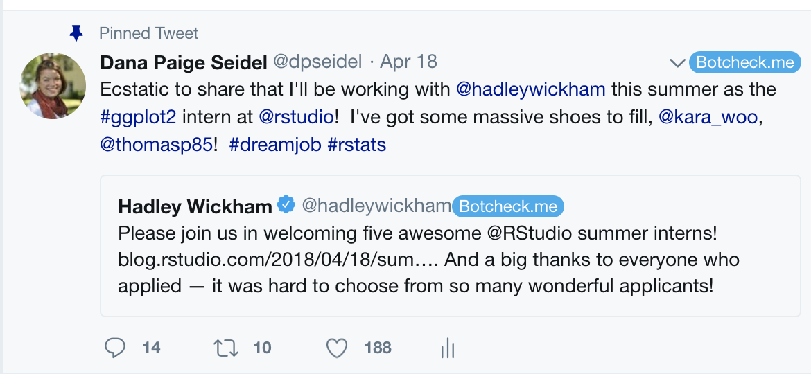

:star: **Personal Announcement!:** This summer I've been hired to work as the 
ggplot2 intern at RStudio! I'm excited to expand my development skills and get 
my hands dirty maintaining a package used by so many! :star:

The blog posts from previous interns [Kara Woo](https://www.tidyverse.org/articles/2017/09/ggplot2-internship/) 
and [Thomas Lin Pedersen](https://www.data-imaginist.com/2016/becoming-the-intern/) really
helped ease the nerves so, with a little determination and some blogging practice,
I hope to be able to pay it forward with a proper record of my internship experience! Stay tuned!

Even with all the added intensity of taking this on while also trying to finish my PhD, 
I can't wait to get started! First day June 4th!
