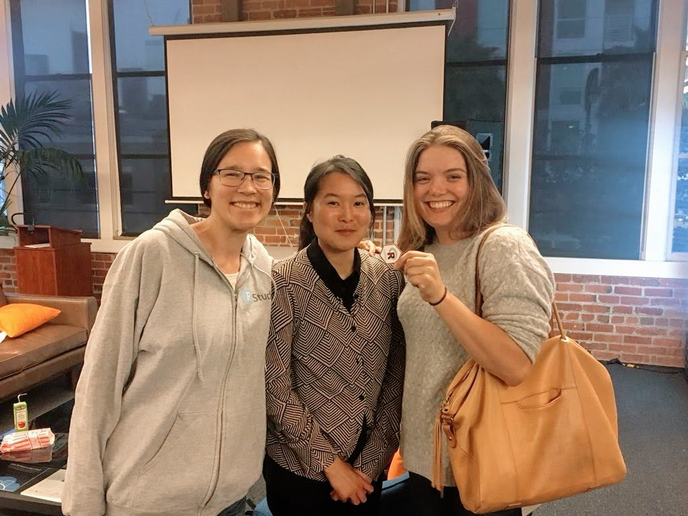

Like two\* others before me, my summer project was to dive into ggplot2's source
code and make myself useful. As I joked frequently to my fellow summer 2018 
interns, as far as ggplot2 was concerned, this was a create-your-own-adventure 
internship from the start. Hadley pointed out some issues that were interesting 
or low-hanging fruit and encouraged me to review the open issues (there were 
~80-90 open at any given time this summer) and dive into any I found interesting. 

To be frank, this was a bit of an intimidating start to my first ever 
development experience. I came in having *used* R for 10 years and ggplot2 for 
nearly as long, but my only open source development experience was around 
education materials, not code. Thankfully I wasn't starting from scratch: my 
previous internship with Google Maps was analytics-based but gave me experience 
working with a large code base, compulsory code review, and version control, all 
things I saw again and again during my RStudio/ggplot2 internship!

After a nervous first few weeks, I came to love the freedom to spend days
pulling on any thread of interest and learning to unravel different parts of 
ggplot2 and put them back together again. In fact, at times it felt quite 
similar to life as a full time PhD -- only with more of an emphasis on regular 
deliverables :joy:. Quite naturally as I began to work on various bugs and 
feature requests of interest, I built small domains of knowledge and I continued
to take on related issues; thus, over my summer in ggplot2, I primarily worked 
in three areas: scales, themes, and on the secondary axis\**. 

<table class="image">
<caption align="bottom"> 3 out of 5: interns Irene Steves, Fanny Chow, and Me after Fanny's August RLadiesSF talk! <br/> (Photo Cred: Gabriela de Queiroz)</caption>
<tr><td></td></tr>
</table>

## Scales

Because of the mid summer timing of the ggplot2 3.0.0 release, I started out 
working with [scales](https://scales.r-lib.org/) - a powerful little package 
driving calculation of most of the scale palettes, breaks, labels, and 
transformations in ggplot2 and, as a standalone package, making them available 
for use with any visualization engine in R.  

This was actually a phenomenal way to start out. In comparison to ggplot2, 
scales is a tiny lightweight package, with fairly straightforward functions 
making it easier for community members (and baby developers like me!) to 
understand and contribute to. My first task was to dust off a handful of old PRs
and tackle as many of the open issues as I could. Ultimately with my summer's 
work and 20+ community contributions, we got scales 1.0.0 out the door on 
August 10th (my very last day!) with some pretty big changes! See [my blogpost](https://www.tidyverse.org/articles/2018/08/scales-1-0-0/) over on 
tidyverse.org for more info about the release and what you can do with the 
scales package. Also check out the [new website](https://scales.r-lib.org/) I 
built for scales over the summer using pkgdown! 

## Themes
By far, my challenge with the largest scope in ggplot2 this summer was to make 
default aesthetics (e.g. colour and fill) "themeable", meaning able to be set by
`theme()`. Ultimately this feature will allows users to change many of the 
default aesthetics (color from black to purple for instance) for all their plots
in a much more intuitive way. One can imagine companies who have a custom theme 
might want to also have custom defaults colors. Furthermore it could allow
smarter defaults: `theme_dark()` for instance can be set to use light colors
rather than inconveniently displaying black points on a dark background by default. 

This project required me to dive deep into the internals of ggplot2 to understand
how layers and themes are built into the plot and in what order. It really taught
me how to use the debugging functions in R and was a great crash course in tidy 
eval. Although still a 
[work in progress](https://github.com/tidyverse/ggplot2/pull/2749/), I promise
I'm going to finish it soon Hadley :sweat_smile:! Keen users should expect this
to roll out in development ggplot2 sometime this fall hopefully. 

## Secondary axes

Finally, in my last few weeks I found myself solving a number of bugs and adding
functionality to the secondary axis api. The changes are mostly internal facing
but notably secondary axes now respect tidy evaluation, and appropriately mirror 
transformed axes. Additionally, I have another open PR to add `sec_axis()` 
functionality for [datetime scales](https://github.com/tidyverse/ggplot2/pull/2806);
this feature should be available very soon. 

Thanks especially to Thomas Lin Pedersen (original ggplot2 intern* and author of
the sec_axis api) for meeting with me to brainstorm, answer my questions, and 
for reviewing my PRs.

## Other projects of note

Over the summer I did a whole host of other small tasks and a boatload of 
documentation that don't fit into the categories above and aren't glamorous 
enough to cover on their own, but there are two other outstanding projects I 
worked on that were just too fun not to mention briefly below:

### The bug of grid destiny

Ever seen this error? You're not alone :stuck_out_tongue_closed_eyes:!

```Error in grid.Call(C_textBounds, as.graphicsAnnot(x$label), x$x, x$y, : polygon edge not found```

It started cropping up for most users when they started using `geom_sf()`; a 
little trick of fate that led most (including Hadley!) to assume it was a 
problem with the sf objects, often *polygons*, they were trying to plot! In 
fact, this particular error is triggered when special characters are used in
axis tick labels - something `geom_sf()` does by default, using the degree 
symbol to denote latitude and longitude. Most dumbfounding of all, this error 
only occurs *intermittently* on MacOS when using the quartz bitmap device 
(the default) and the RStudio graphics device. Use a PC, a different graphics
device, or remove the axis tick labels and this bug will never occur. Don't and 
you'll see it 10-20% of the time. Want to prove it to yourself? Try out [this code](https://gist.github.com/dpseidel/322db7110b8590d77ba20f3db8f399fc) using
RStudio and the defaults on any Mac! Then try from the terminal or using cairo 
or the png driver and you'll see the error disappears!

This particular puzzle frustrated and thrilled me from the first week to the 
very last of my internship. It turns out it's not a ggplot2 bug at all, instead 
the error gets returned by an internal grid function when it gets passed a 
missing or infinite value by the graphics device. Big thanks to my fellow intern
Tim Mastny who helped me get a mirror of the grid package and get started with 
lldb - a debugger for C. We spent HOURS on my last day getting sucked into 
solving this tricky little bug together. Ultimately, despite our very best 
efforts and learning a lot, I had to turn this one over to the RStudio IDE team
for further debugging. See the whole saga in the github issue [here](https://github.com/tidyverse/ggplot2/issues/2252). Hopefully this will 
be fixed soon! And hopefully soon I'll write up a full length blog post about 
this little bug and what I learned about debugging in R and C. 

### Right to left plotting

Inspired by [this post](http://rnotr.com/ggplot/plotly/arabic-plots/) early on 
in my internship, I began working on creating a new coord and theme element to
allow for easy right to left plots in ggplot2. While not every RtL language uses
RtL plots (thanks to fellow intern Irene Steves for doing so much research on 
the subject for me!), it seemed like an important opportunity to implement 
features that allow for greater flexibility and internationalization of the 
ggplot2 package and I was excited to work on it. 

Though this too is 
[not complete yet](https://github.com/tidyverse/ggplot2/pull/2817), it turned
out to be really easy to implement in principle and just needs some polish 
before rolling out in the development version of ggplot2, hopefully later this 
fall. 

# Some convictions gained:
- **The time is now to learn Rcpp!** This is not wholly related to ggplot2 but 
during my summer, especially during work week when I got a chance to talk with 
Rcpp authors Romain Francois and JJ Allaire, I realized Rcpp is a critical tool 
if I want to do serious analysis and development in R. Coming back to my PhD in 
the last month, it's even more obvious that if I wish to write code for 
performance I need to branch out. Stay tuned for a whole host of blog posts when
I finally get around to learning it and transforming some of my old code. 

- **Development is my new forever hobby.**  I love the puzzles, the creativity, 
and the community, and I literally am just bursting with ideas. I just need to 
find the time to finish a few things (like open PRs and PhDs...:grimacing:) 
before diving into new projects. As you can see a number of my biggest projects
from my internship are still incomplete - I'm incredibly grateful all this work
is open source and thus I am still empowered to contribute. 

- **We need more women in development.** While 3 out of 5 of the 2018 RStudio
interns were women, over the summer, I don't believe I saw a single pull request
authored by a woman outside the tidyverse team who wasn't a previous intern or
Dr. Charlotte Wickham. That's insane! But, at the same time, I intuitively get 
it! Before this summer, despite knowing these packages were open source and 
community developed and having many of the skills needed, I didn't see the 
welcome mat and I didn't have a clue where to start. Over the summer, not only
was it my job to participate in the development process first hand, I also got
to talk with and hear from Hadley and others about their opinions on best 
practices for development and community contribution. In some cases I even 
worked on documenting them! I really want to pass on this knowledge and take out
some of the fear factor around open source development for other women, many of 
whom are beyond capable but just don't see it yet. **In this vein, I am in 
talks to orchestrate a "Tidy development" workshop for Rladies-SF this fall, 
so if you're in the bay area and interested, stay tuned!**

# Many many thank yous:
To Hadley Wickham, RStudio, and the whole tidyverse team: thank you for being 
welcoming, engaged, patient, and helpful people and for giving me the 
opportunity to join the team for a summer and to be a continuing contributor.

A special thank you for bringing us interns along to RStudio Work Week 
(a biannual meetup for this otherwise 100% distributed company). There, I got a 
chance to meet and talk with JJ Allaire, Tareef Kawaf, Joe Cheng, Winston Chang,
Jim Hester, Jenny Bryan, Mara Averick, and many more. All of whom made an 
indelible impact on my summer.

To my fellow interns, for being brilliant, good humored, helpful people. 
I hope our paths cross again. 

And finally, to Becky Bajan and Jen Hecht, a huge thank you for being the unsung
heroes of the internship program and making this all happen. 

#### Footnotes:
\* Kara Woo (2017) and Thomas Lin Pedersen (2016) both worked on ggplot2 as
"interns" in previous years but had longer, less standardized, experiences. 
You can read about their experiences in their own words
[here](https://www.tidyverse.org/articles/2017/09/ggplot2-internship/)
and [here](https://www.data-imaginist.com/2016/becoming-the-intern/), 
respectively. 2018 was the first year of the official RStudio internship 
program: 5 interns were chosen to work on five separate projects led by five 
different mentors full time for 10 weeks. To read more about the different
projects from this year, see this 
[post](https://blog.rstudio.com/2018/02/12/summer-interns/). If you're 
interested in applying to a RStudio internship in the future keep an eye on 
the [RStudio blog](https://blog.rstudio.com/). 

\** If you want to see more of what I did this summer, take a look at [my slides](https://www.danaseidel.com/TidyverseShower) from a talk I gave to the
tidyverse team August 6th reviewing some of the many things I tackled.
**OR if you're in the bay area, come to Rladies-SF on September 19th, I'll be
talking about my internship experience live!**


